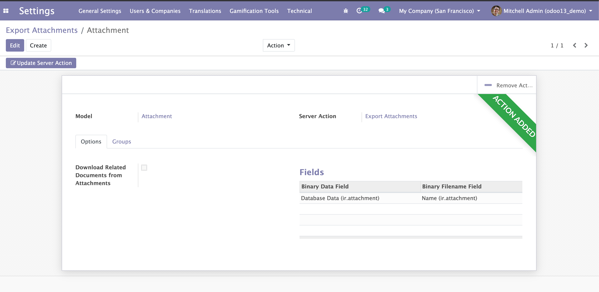
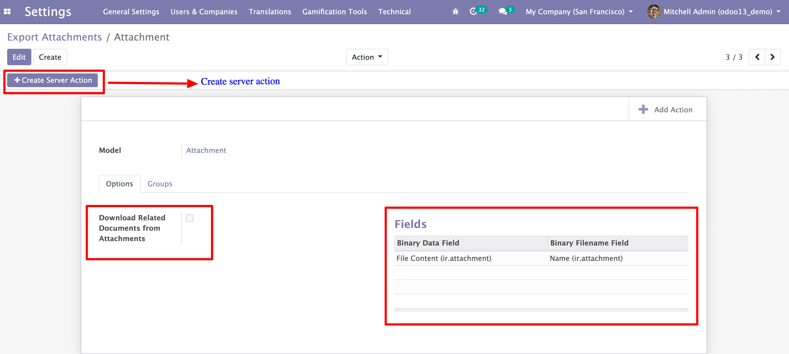
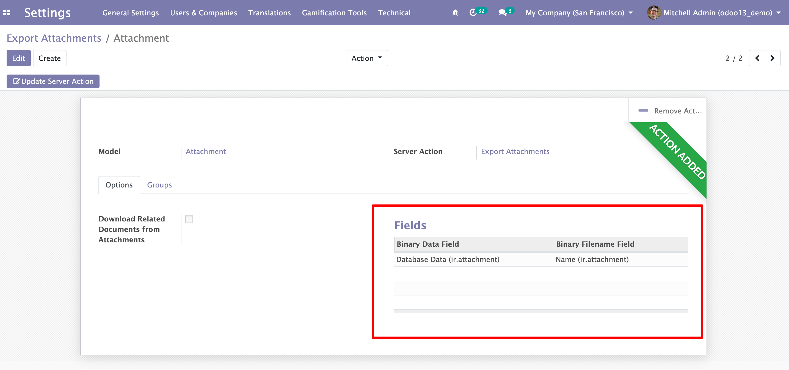
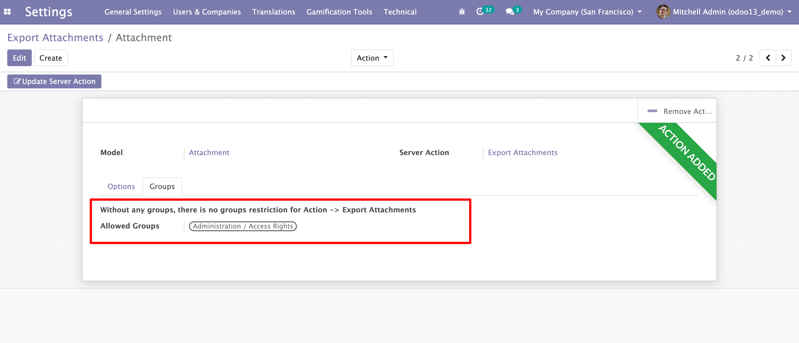
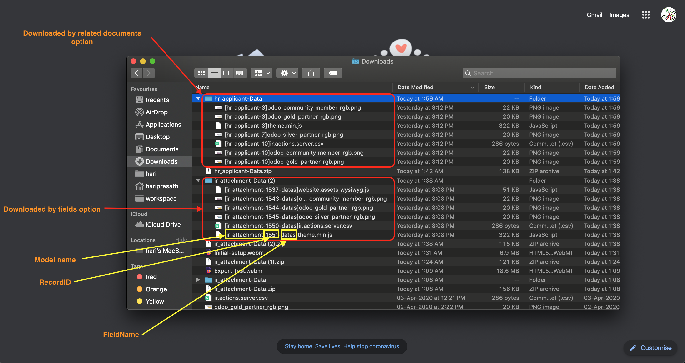

# Export Attachments

In Odoo, We can export all fields but binary fields is very hard to download for many records at once. So planned to give a solution for that.

- This module helps you to download all attachments or any binary fields in that model at once.
    
## Menu and Configuration
    
- Menu in Settings -> Technical -> Export Attachments -> Export Attachments Action

- Export Menu Tree View

- Export Menu Form View

- Create Server Action

- View : Any Configured model -> Action -> Export Attachments

## Features
    
- If any model does not have an binary fields or they want to download related documents

- Select Which binary fields you want to download

- Restrict Download attachments to assign allowes groups

- Create Server Action / Update Server Action / Remove (Action -> Export Attachments) / Add (Action -> Export Attachments)

## Options

1) To download related all attachments, enable "Download all related documents from attachments"

2) To download specific binary field, fill fields

## Filename Details

## Videos

### Initial Setup

### Export Test

## For next upgrade 

- Bulk import attachments using file name: 
    
    `[<model>-<recordID>-<field_name>]<filename>`

    Ex:-

    `[hr_applicant-10-document]odoo_gold_partner_rgb.png`

    We can easily import multiple attachments at once !!! 
